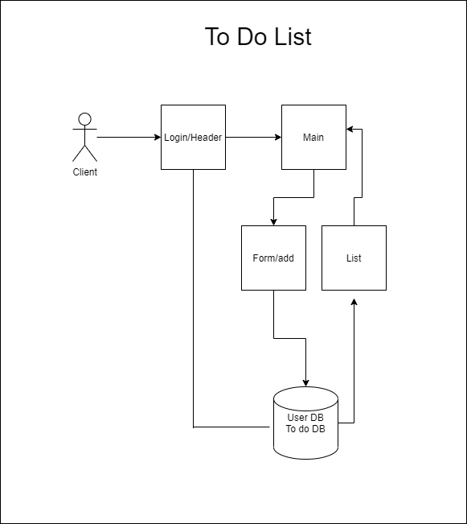

# Hooks - API

### Author: Sarah / Brendon

### Links and Resources

- [submission PR]()
- [ci/cd]() (GitHub Actions)
- [back-end server url](http://xyz.com) (when applicable)
- [front-end application](http://xyz.com) (when applicable)

### User Stories

1. As a user, I would like an easy way to add a new to do item using an online interface

2. As a user, I would like my to do items to have an assignee, due date, difficulty meter, status and the task itself

3. As a user, I would like to delete to do items that are no longer needed

4. As a user, I would like to easily mark to do items as completed

5. As a user, I would like to edit an existing to do item

### Setup

#### `.env` requirements (where applicable)

#### How to initialize/run your application (where applicable)

#### How to use your library (where applicable)

#### Tests

- How do you run tests?
    - 
- Any tests of note?
- Describe any tests that you did not complete, skipped, etc
    - 

#### UML

Link to an image of the UML for your application and response to events

[Return to Directory](##Directory)